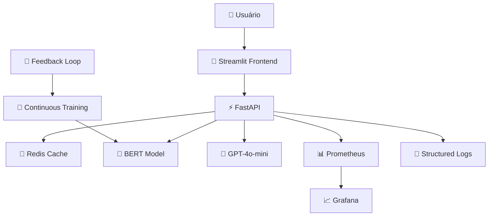

# 🍔 SentiBR - Sistema Inteligente de Análise de Sentimento para Reviews do iFood

<div align="center">


**Análise de Sentimento de Classe Mundial com BERT, FastAPI, Streamlit e MLOps**

[Demo](#-demo) • [Features](#-features) • [Quickstart](#-quickstart) • [Arquitetura](#-arquitetura) • [Documentação](#-documentação)

</div>

---

## 📋 Índice

- [Sobre o Projeto](#-sobre-o-projeto)
- [Features Principais](#-features-principais)
- [Arquitetura](#-arquitetura)
- [Tech Stack](#-tech-stack)
- [Quickstart (3 comandos)](#-quickstart-3-comandos)
- [Instalação Detalhada](#-instalação-detalhada)
- [Uso](#-uso)
- [Estrutura do Projeto](#-estrutura-do-projeto)
- [Treinamento do Modelo](#-treinamento-do-modelo)
- [API Documentation](#-api-documentation)
- [Monitoramento](#-monitoramento)
- [Testes](#-testes)
- [Deployment](#-deployment)
- [Decisões Técnicas](#-decisões-técnicas)
- [Roadmap](#-roadmap)
- [Contribuindo](#-contribuindo)
- [Licença](#-licença)

---

## 🎯 Sobre o Projeto

**SentiBR** é uma plataforma completa de análise de sentimento para reviews de restaurantes do iFood, construída com as melhores práticas de MLOps e Data Science. O projeto demonstra um ciclo completo de ML/DL, desde a experimentação até a prototipagem para produção.

### 🌟 Diferenciais

- ✅ **Aspect-Based Sentiment Analysis**: Análise de sentimento por aspecto (comida, entrega, atendimento, preço)
- ✅ **Comparação BERT vs GPT**: Trade-off entre latência, custo e qualidade
- ✅ **Observabilidade Completa**: Prometheus + Grafana + Logging estruturado
- ✅ **Data Drift Detection**: Monitoramento de distribuição de dados
- ✅ **LLM-as-a-Judge**: GPT-4 avalia qualidade das predições
- ✅ **Explicabilidade**: LIME/SHAP para interpretar decisões
- ✅ **Continuous Learning**: Feedback loop para melhoria contínua
- ✅ **Production-Ready**: Docker, testes, CI/CD, documentação completa

---

## 🚀 Features Principais

### 🤖 Machine Learning
- Fine-tuning de BERT português para classificação de sentimento
- Suporte a análise multi-aspecto
- Explicabilidade com LIME/SHAP
- Hyperparameter tuning com Optuna
- MLflow para tracking de experimentos

### 🌐 API REST
- FastAPI com validação Pydantic
- Endpoints assíncronos
- Rate limiting
- Health checks
- Swagger UI customizado
- Comparação BERT vs GPT-4o-mini

### 🎨 Frontend Interativo
- Interface Streamlit responsiva
- Análise em tempo real
- Dashboard de métricas
- Interface de feedback
- Visualizações interativas

### 📊 Observabilidade
- Prometheus metrics
- Grafana dashboards
- Logging estruturado (JSON)
- Alertas customizados
- Data drift detection

### 🐳 Infrastructure
- Docker Compose para orquestração
- Ngrok para acesso público
- CI/CD ready
- Testes automatizados

---

## 🏗️ Arquitetura



---

## 🛠️ Tech Stack

### Core ML/DL
- **PyTorch** - Deep Learning framework
- **Transformers (Hugging Face)** - BERT implementation
- **scikit-learn** - ML utilities

### MLOps
- **MLflow** - Experiment tracking
- **Optuna** - Hyperparameter optimization
- **DVC** - Data versioning (opcional)
- **Great Expectations** - Data validation

### Backend
- **FastAPI** - Modern API framework
- **Uvicorn** - ASGI server
- **Pydantic** - Data validation
- **Redis** - Caching layer

### Frontend
- **Streamlit** - Interactive UI
- **Plotly** - Visualizations

### Monitoring
- **Prometheus** - Metrics collection
- **Grafana** - Visualization
- **Loguru** - Structured logging

### LLM
- **OpenAI API** - GPT-4o-mini for evaluation

### Infrastructure
- **Docker** - Containerization
- **Docker Compose** - Orchestration
- **Ngrok** - Public access

---

## ⚡ Quickstart (3 comandos)

```bash
# 1. Clone e setup
git clone <repo-url>
cd sentibr-ifood-analysis
cp .env.example .env  # Edite com suas keys

# 2. Build e start
docker-compose up -d

# 3. Acesse
# Frontend: http://localhost:8501
# API: http://localhost:8000/docs
# Grafana: http://localhost:3000
```

---

## 📦 Instalação Detalhada

### Pré-requisitos
- Python 3.10+
- Docker & Docker Compose
- 8GB RAM mínimo
- GPU (opcional, acelera treinamento)

### Setup Local

```bash
# 1. Clone o repositório
git clone <repo-url>
cd sentibr-ifood-analysis

# 2. Crie ambiente virtual
python -m venv venv
source venv/bin/activate  # Windows: venv\Scripts\activate

# 3. Instale dependências
pip install -r requirements.txt

# 4. Configure variáveis de ambiente
cp .env.example .env
# Edite .env com suas configurações (OpenAI API key, etc.)

# 5. Download do modelo pré-treinado (se disponível)
# Ou execute o treinamento (veja seção de Treinamento)
```

---

## 💻 Uso

### 1. Treinar o Modelo

```bash
# Execute o script de treinamento
python src/training/train.py --config configs/train_config.yaml

# Com hyperparameter tuning
python src/training/hyperparameter_tuning.py --trials 20
```

### 2. Iniciar a API

```bash
# Local
uvicorn src.api.main:app --reload --host 0.0.0.0 --port 8000

# Docker
docker-compose up api
```

### 3. Iniciar o Frontend

```bash
# Local
streamlit run frontend/app.py

# Docker
docker-compose up frontend
```

### 4. Testar a API

```bash
# Health check
curl http://localhost:8000/api/v1/health

# Predição simples
curl -X POST http://localhost:8000/api/v1/predict \
  -H "Content-Type: application/json" \
  -d '{"text": "A comida estava deliciosa mas a entrega demorou muito!"}'

# Resposta esperada:
{
  "sentiment": "misto",
  "confidence": 0.87,
  "aspects": {
    "comida": {"sentiment": "positivo", "confidence": 0.95},
    "entrega": {"sentiment": "negativo", "confidence": 0.88}
  },
  "latency_ms": 45
}

# Comparação BERT vs GPT
curl -X POST http://localhost:8000/api/v1/predict/compare \
  -H "Content-Type: application/json" \
  -d '{"text": "Experiência incrível!"}'
```

---

## 📁 Estrutura do Projeto

```
sentibr-ifood-analysis/
│
├── 📁 data/                      # Dados do projeto
│   ├── raw/                      # Dados brutos
│   ├── processed/                # Dados processados
│   └── dvc/                      # Versionamento DVC
│
├── 📁 models/                    # Modelos treinados
│   ├── bert_finetuned/           # BERT fine-tuned
│   ├── experiments/              # Experimentos MLflow
│   └── model_registry/           # Registro de versões
│
├── 📁 src/                       # Código fonte
│   ├── training/                 # Pipeline de treinamento
│   │   ├── train.py             # Script principal
│   │   ├── evaluate.py          # Avaliação
│   │   ├── data_pipeline.py     # ETL
│   │   └── config.py            # Configurações
│   │
│   ├── api/                      # API REST
│   │   ├── main.py              # FastAPI app
│   │   ├── models.py            # Pydantic models
│   │   ├── inference.py         # Lógica de predição
│   │   └── middleware.py        # Middleware
│   │
│   ├── monitoring/               # Observabilidade
│   │   ├── metrics.py           # Prometheus metrics
│   │   ├── drift_detector.py    # Drift detection
│   │   └── logger.py            # Logging config
│   │
│   └── evaluation/               # Framework de avaliação
│       ├── eval_suite.py        # Suite de métricas
│       ├── llm_judge.py         # LLM evaluation
│       └── explainer.py         # LIME/SHAP
│
├── 📁 frontend/                  # Streamlit app
│   ├── app.py                   # App principal
│   ├── pages/                   # Multi-page app
│   ├── components/              # Componentes
│   └── utils/                   # Utilidades
│
├── 📁 notebooks/                 # Jupyter notebooks
│   ├── 01_eda.ipynb             # Análise exploratória
│   ├── 02_experiments.ipynb     # Experimentos
│   └── 03_bert_vs_gpt.ipynb     # Comparações
│
├── 📁 docker/                    # Docker configs
│   ├── Dockerfile.api
│   ├── Dockerfile.frontend
│   └── docker-compose.yml
│
├── 📁 monitoring/                # Monitoring configs
│   ├── prometheus.yml
│   └── grafana/
│       └── dashboards/
│
├── 📁 tests/                     # Testes
│   ├── unit/
│   ├── integration/
│   └── load/
│
├── 📁 scripts/                   # Scripts auxiliares
│   ├── expose.sh                # Ngrok
│   └── train.sh                 # Training helper
│
├── requirements.txt              # Dependências Python
├── .env.example                 # Variáveis de ambiente
├── .gitignore
└── README.md                    # Este arquivo
```

---

## 🧠 Treinamento do Modelo

### Dataset

Utilizamos reviews de restaurantes brasileiros com as seguintes características:
- **Tamanho**: ~50.000 reviews
- **Classes**: Positivo, Negativo, Neutro
- **Aspectos**: Comida, Entrega, Atendimento, Preço
- **Idioma**: Português brasileiro

### Processo de Treinamento

1. **Pré-processamento**
   - Limpeza de texto
   - Tokenização com BERT tokenizer
   - Augmentation (opcional)

2. **Fine-tuning**
   - Modelo base: `neuralmind/bert-base-portuguese-cased`
   - Otimizador: AdamW
   - Learning rate: 2e-5
   - Batch size: 16
   - Epochs: 3-5

3. **Avaliação**
   - Métricas: F1-score, Precision, Recall
   - Confusion Matrix
   - Análise de erros

### Reproduzir Treinamento

```bash
# 1. Preparar dados
python src/data/prepare_dataset.py

# 2. Treinar modelo
python src/training/train.py

# 3. Avaliar
python src/training/evaluate.py --model_path models/bert_finetuned

# 4. Visualizar no MLflow
mlflow ui
# Acesse: http://localhost:5000
```

---

## 📚 API Documentation

A documentação completa da API está disponível em:
- **Swagger UI**: http://localhost:8000/docs
- **ReDoc**: http://localhost:8000/redoc

### Principais Endpoints

| Método | Endpoint | Descrição |
|--------|----------|-----------|
| POST | `/api/v1/predict` | Predição única |
| POST | `/api/v1/predict/batch` | Predição em lote |
| POST | `/api/v1/predict/compare` | BERT vs GPT |
| GET | `/api/v1/health` | Health check |
| GET | `/api/v1/models/info` | Info do modelo |
| POST | `/api/v1/feedback` | Enviar feedback |
| POST | `/api/v1/explain` | Explicabilidade |
| GET | `/api/v1/metrics` | Prometheus metrics |

---

## 📊 Monitoramento

### Prometheus Metrics

Acesse: http://localhost:9090

Métricas disponíveis:
- `api_requests_total` - Total de requisições
- `api_request_duration_seconds` - Latência
- `prediction_confidence_score` - Confiança média
- `drift_score` - Score de drift

### Grafana Dashboards

Acesse: http://localhost:3000 (admin/admin)

Dashboards:
1. **API Performance** - Latência, throughput, erros
2. **Model Performance** - Distribuição, confiança, drift
3. **Business Metrics** - Sentimentos por categoria

### Data Drift Detection

```bash
# Check drift manualmente
python src/monitoring/drift_detector.py --baseline data/processed/baseline.csv

# API endpoint
curl http://localhost:8000/api/v1/drift/check
```

---

## 🧪 Testes

```bash
# Todos os testes
pytest

# Com coverage
pytest --cov=src --cov-report=html

# Testes específicos
pytest tests/unit/test_inference.py
pytest tests/integration/

# Load tests
locust -f tests/load/locustfile.py
```

---

## 🚀 Deployment

### Docker

```bash
# Build
docker-compose build

# Start all services
docker-compose up -d

# Logs
docker-compose logs -f api

# Stop
docker-compose down
```

### Ngrok (Acesso Público)

```bash
# 1. Instale ngrok: https://ngrok.com/download

# 2. Exponha API
ngrok http 8000

# 3. Exponha Frontend
ngrok http 8501

# As URLs públicas serão geradas automaticamente
```

### Cloud Deployment (Opcional)

Para deploy em produção, considere:
- **AWS**: ECS/EKS + ALB
- **GCP**: Cloud Run / GKE
- **Azure**: Container Apps
- **Heroku/Railway**: Deployment simples

---

## 🤔 Decisões Técnicas

### Por que BERT?

- ✅ SOTA para NLP em português
- ✅ Modelo compacto (~110M parâmetros)
- ✅ Latência baixa (<100ms)
- ✅ Fine-tuning eficiente
- ✅ Interpretabilidade razoável

### Por que FastAPI?

- ✅ Performance excelente
- ✅ Async native
- ✅ Validação automática (Pydantic)
- ✅ Swagger UI built-in
- ✅ Type hints

### Por que Streamlit?

- ✅ Desenvolvimento rápido
- ✅ Interface limpa
- ✅ Integração com plotly
- ✅ Multi-page apps
- ✅ Deploy simples

### BERT vs GPT-4o-mini

| Métrica | BERT | GPT-4o-mini |
|---------|------|-------------|
| Latência | ~45ms | ~1200ms |
| Custo/1000 req | $0 | ~$0.10 |
| F1-Score | 0.89 | 0.92 |
| Explicabilidade | Alta | Média |
| **Recomendação** | Produção | Casos críticos |

---

## 🗺️ Roadmap

### ✅ Versão 1.0 (Atual)
- [x] Fine-tuning BERT
- [x] API REST completa
- [x] Frontend Streamlit
- [x] Monitoramento básico
- [x] Docker deployment

### 🔄 Versão 1.1 (Próximo)
- [ ] Aspect-based analysis completo
- [ ] A/B testing framework
- [ ] Continuous training pipeline
- [ ] Multi-model ensemble

### 🚀 Versão 2.0 (Futuro)
- [ ] Deploy em Kubernetes
- [ ] API GraphQL
- [ ] Mobile app
- [ ] Suporte multi-idioma
- [ ] Real-time streaming

---

## 🤝 Contribuindo

Contribuições são bem-vindas! Por favor:

1. Fork o projeto
2. Crie uma branch (`git checkout -b feature/AmazingFeature`)
3. Commit suas mudanças (`git commit -m 'Add AmazingFeature'`)
4. Push para a branch (`git push origin feature/AmazingFeature`)
5. Abra um Pull Request

---

## 📄 Licença

Este projeto está sob a licença MIT. Veja [LICENSE](LICENSE) para mais detalhes.

---

## 👨‍💻 Autor

Desenvolvido com ❤️ para demonstrar excelência em Data Science e MLOps.

---

## 📞 Contato

- 📧 Email: contato@douglasbraga.com
- 💼 LinkedIn: [linkedin](https://www.linkedin.com/in/dgbraga/)


---

<div align="center">

**⭐ Se este projeto foi útil, considere dar uma estrela!**

</div>
